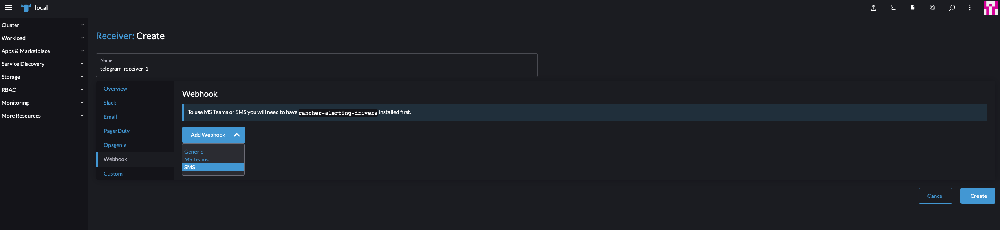

# Cluster Setup  Details:

## <u>Local:</u>

- Rancher: `2.6.5`
- k3s: `v1.23.6+k3s1`
- Docker: `19.03`
- Cert-Manager: `1.7.1` 

## <u>Downstream:</u>

- RKE: `v1.23.6-rancher1-1`


---------
# Overview

Prometheus is an open-source systems monitoring and alerting toolkit. Prometheus collects and stores its metrics as time series data, i.e. metrics information is stored with the timestamp at which it was recorded, alongside optional key-value pairs called labels.

## **Features**
<u>Prometheus's main features are:</u>

- a multi-dimensional data model with time series data identified by metric name and key/value pairs
- PromQL, a flexible query language to leverage this dimensionality
- no reliance on distributed storage; single server nodes are autonomous
- time series collection happens via a pull model over HTTP
- pushing time series is supported via an intermediary gateway
- targets are discovered via service discovery or static configuration
- multiple modes of graphing and dashboarding support

----------
# Install Prometheus and Grafana

- Once you login to the Rancher UI, select the cluster on which you would like to enable `Monitoring`.
- Head over to the `Apps` section and select `Charts`.
- You would see a list of apps that is available from the `Rancher` and `Partner` default repositories. 


- From this list, select `Monitoring` app which is a helm chart. 
- The Monitoring helm chart installs "Prometheus" and "Grafana" for us. 
- Click on the "Install" button to see more options. 
- You have the option to customize "helm values" by clicking on `Customize Helm options before install` checkbox.
- Once you are happy with the configuration, you can hit the "Install" button.
- Upon successful installation you should see an output similar to the one below.

```
NAME: rancher-monitoring
LAST DEPLOYED: Tue Jul 12 14:28:07 2022
NAMESPACE: cattle-monitoring-system
STATUS: deployed
REVISION: 1
TEST SUITE: None
NOTES:
rancher-monitoring has been installed. Check its status by running:
kubectl --namespace cattle-monitoring-system get pods -l "release=rancher-monitoring"
Visit https://github.com/prometheus-operator/kube-prometheus for instructions on how to create & configure Alertmanager and Prometheus instances using the Operator.
---------------------------------------------------------------------
SUCCESS: helm upgrade --install=true --namespace=cattle-monitoring-system --timeout=10m0s --values=/home/shell/helm/values-rancher-monitoring-100.1.2-up19.0.3.yaml --version=100.1.2+up19.0.3 --wait=true rancher-monitoring /home/shell/helm/rancher-monitoring-100.1.2-up19.0.3.tgz
---------------------------------------------------------------------
```

- From here you can configure monitoring for your cluster by selecting `Monitoring` from the left pane from the Monitoring Landing page. 


----------

# Configurations:

## <u>PrometheusRules:</u>

You can configure these objects if you want to monitor your endpoints (nodes, clusters, pods etc) and trigger alerts if a condition is met. 

<u>Demo: </u>

1.) Check for pods that are unhealthy. These could be pods which are in `Pending` , `Unknown` , `Failed` state.

```
~/learning/rancher/prometheus/yamls » k get pods -owide                                                                                                                                                                                                                      
NAME                           READY   STATUS             RESTARTS   AGE     IP              NODE                                        NOMINATED NODE   READINESS GATES
crashloop-dummy-pod3           0/1     CrashLoopBackOff   6          9m1s    10.42.169.236   ip-10-0-0-166.ap-south-1.compute.internal   <none>           <none>
example-app-7d95cbf666-45tlt   1/1     Running            0          10m     10.42.169.245   ip-10-0-0-166.ap-south-1.compute.internal   <none>           <none>
example-app-7d95cbf666-6r5tq   1/1     Running            0          10m     10.42.169.197   ip-10-0-0-166.ap-south-1.compute.internal   <none>           <none>
example-app-7d95cbf666-t5mj8   1/1     Running            0          10m     10.42.169.196   ip-10-0-0-166.ap-south-1.compute.internal   <none>           <none>
nginx                          1/1     Running            0          4d5h    10.42.169.201   ip-10-0-0-166.ap-south-1.compute.internal   <none>           <none>
nginx-app                      1/1     Running            0          4m11s   10.42.169.246   ip-10-0-0-166.ap-south-1.compute.internal   <none>           <none>
swiss                          1/1     Running            0          12d     10.42.169.240   ip-10-0-0-166.ap-south-1.compute.internal   <none>           <none>
unhealthy-dummy-pod2           0/1     Pending            0          9m1s    <none>          <none>                                      <none>           <none>
```

- You can see pod `unhealthy-dummy-pod2` in a `Pending` state. 
- We will create a PrometheusRule to find pods in Pending state. 
- For this head over to the `Rancher UI > Monitoring > Advanced > Prometheus Rules` option.


- Click on `Create` on the top right corner.
- Give it a rule name, group name and click on `Add Alert` from the `Alerting Rules` section.
- Give the alert a name and the following `PromQL Expression` so that Prometheus detects the pods that are unhealthy.

```
min_over_time(sum by (namespace, pod) (kube_pod_status_phase{phase=~"Pending|Unknown|Failed"})[15m:1m]) > 0
```
- Choose the `Severity` for the alert based on the importance of the workload.
- You can also add a "Description", "Message", "Summary" and a "Runbook URL".
- Once you are happy with the configurations, click on the `Create` button to create the object. 
- To validate if the created rule got created successfully, head over to the `Monitoring` section again and you should see `Prometheus Rules - Configured Rules` section which will open a new tab in the browser when clicked. 
- In the Prometheus rules page, if you search for the created rule based on the `AlertName`, you should be able to see the Prometheus Rule created. If you do not find the rule here, then there are some mis-configurations due to which this was not created successfully.


---------
## <u>Alertmanager:</u>

While Prometheus monitors workloads and detects issues with them based on the `PromQL` expressions configured, Alertmanger picks up these alerts when fired and sends them to the administrator based on provider configurations.

We have seen PrometheusRules being created based on the provided configuration but how do you check if Alertmanager is detecting the issues when there is a `PromQL` expression matches? You can do this by heading over to Monitoring section from the left pane and clicking on `Alertmanager` link which opens up a new tab in the browser.

- Once you have the Alertmanager page open, you can see the list of `Alerts` in the initial page. 
- Expand all groups and you should see the alert being picked up by Alertmanager. 
- You can also see these alerts in the landing page of `Monitoring`.


Now, how can you configure these alerts to reach the Administrator? You can configure `Receivers` and `Routes` which will send these alerts to the enduser using multiple providers. Check the next section on how to configure them.

## <u>Receiver:</u>
The `Receiver` defines to which provider the alerts should be sent to when alerts are detected.


## <u>Routes</u>
The `Route` defines which receiver to use and how to detect these alerts which are fired by using `Match` operation and the frequency on when these alerts should be checked and sent to the `Receiver`.


As soon as the `Route` is configured, based on the `Repeat interval` the alert will be sent to the provider with the details of the alert. 

```json
{
  "receiver": "webhook",
  "status": "firing",
  "alerts": [
    {
      "status": "firing",
      "labels": {
        "alertname": "PodsAreUnhealthy",
        "namespace": "default",
        "pod": "unhealthy-dummy-pod2",
        "prometheus": "cattle-monitoring-system/rancher-monitoring-prometheus",
        "severity": "critical"
      },
      "annotations": {
        "description": "Prometheus has detected issues with Pods that are unhealthy.",
        "message": "There are pods in the cluster that are NOT ready!!!",
        "summary": "This is a PrometheusRule created on Rancher cluster by Stalin."
      },
      "startsAt": "2022-07-12T15:50:38.638Z",
      "endsAt": "0001-01-01T00:00:00Z",
      "generatorURL": "https://rancher.stalin.support.rancher.space/k8s/clusters/c-rgrf5/api/v1/namespaces/cattle-monitoring-system/services/http:rancher-monitoring-prometheus:9090/proxy/graph?g0.expr=min_over_time%28sum+by%28namespace%2C+pod%29+%28kube_pod_status_phase%7Bphase%3D~%22Pending%7CUnknown%7CFailed%22%7D%29%5B15m%3A1m%5D%29+%3E+0&g0.tab=1",
      "fingerprint": "55d0163df1fd352c"
    }
  ],
  "groupLabels": {},
  "commonLabels": {
    "alertname": "PodsAreUnhealthy",
    "namespace": "default",
    "pod": "unhealthy-dummy-pod2",
    "prometheus": "cattle-monitoring-system/rancher-monitoring-prometheus",
    "severity": "critical"
  },
  "commonAnnotations": {
    "description": "Prometheus has detected issues with Pods that are unhealthy.",
    "message": "There are pods in the cluster that are NOT ready!!!",
    "summary": "This is a PrometheusRule created on Rancher cluster by Stalin."
  },
  "externalURL": "https://rancher.stalin.support.rancher.space/k8s/clusters/c-rgrf5/api/v1/namespaces/cattle-monitoring-system/services/http:rancher-monitoring-alertmanager:9093/proxy",
  "version": "4",
  "groupKey": "{}/{alertname=\"PodsAreUnhealthy\"}:{}",
  "truncatedAlerts": 0
}
```

- This way you can use the combination of PrometheusRules, Routes & Receivers to configure alerts and send alerts to the enduser.

## <u>Pod Monitors:</u>
So, why would you need Pod Monitors? What are Pod Monitors?'

Pod Monitors are used to scrape metrics from the workloads running on the cluster. The workloads expose a `/metrics` path where all the metrics are dumped by the application and Pod Monitor scrapes those metrics. 

Below, is an example manifest of a Pod Monitor object. 

```yaml
apiVersion: monitoring.coreos.com/v1
kind: PodMonitor
metadata:
  name: example-app
  labels:
    team: frontend
  namespace: cattle-monitoring-system
spec:
  namespaceSelector:
    matchNames: 
    - cattle-monitoring-system
  selector:
    matchLabels:
      app: example-app
  podMetricsEndpoints:
  - targetPort: 8080
```

The Pod monitor looks for application running with label `app=example-app` and scrapes metrics from the port called `web` which is exposed at the application end. 

Once the Pod Monitor is deployed, it will start scraping metrics from the application. You can see this by navigating to the Monitoring landing page and then selecting `Prometheus Targets` > `Graphs`.

In the following page you cat see the graph for the scrapped application by executing the below query.

```
http_request_size_bytes
http_request_duration_microseconds
go_memstats_frees_total
```


## <u>Service Monitors:</u>

Similar to Pod Monitors, you can make use of Service Monitors to scrape metrics from endpoints but not by querying the workload directly. The Service Monitor will connect to a service this time and the service is configured to connect to the workloads. 

So, when would you use a Pod Monitor `VS` Service Monitor?

PodMonitors are used when you would want to scrape metrics from application which aren't exposed like Database.
ServiceMonitors on the other hand are typically used when the workloads use a service. 

Once you have the workload and service running, you can create a Service Monitor to scrape metrics from the service. 

`
apiVersion: monitoring.coreos.com/v1
kind: ServiceMonitor
metadata:
  name: servicemonitor-app
  labels:
    team: frontend
  namespace: cattle-monitoring-system
spec:
  namespaceSelector:
    matchNames: 
    - cattle-monitoring-system
  selector:
    matchLabels:
      app: servicemonitor-app
  endpoints:
  - port: web

`

You can use the similar approach that you used for Pod Monitors to view the graph for Service Monitors. Here, I am using the below query to get metrics for the application for which Service Monitors are configured. 

```
http_requests_total
```


--------------
# Grafana:

## <u>Overview</u>
Grafana allows you to query, visualize, alert on and understand your metrics no matter where they are stored.
To access Grafana, head over to the Monitoring landing page and click on Grafana.

This will open a new tab in the browser where you can start fiddling with Grafana. 


In order to make any configuration, you need to login first. You can do this by clicking on the `Sign In` icon on the left bottom corner.

It will ask you to punch in the credentials. The default creds are:

Username: `admin` & Password: `prom-operator`

Once you have logged-in, you can see a list of default dashboards configured which you can explore to view metrics. 
However, if you would like to create a dashboard, then you can do this by clicking on the `+` icon from the left pane and select Dashboard. You can also, import pre-created dashboard to query and vizsualize the metrics that you are interested in.

Let's choose an existing dashboard `Rancher / Workloads (Pods)` to view the metrics of the Pods running in the cluster. Once you select the dashboard, you would have the flexibility to see the metrics of an individual pod by choosing a specific namespace. Here, I have choosen the application that I have deployed to visualize the metrics.


# Alertmanager Webhook Receivers

For notification mechanisms not natively supported by the Alertmanager, the webhook receiver allows for integration. 

We will make use of **`Alerting Drivers`** to tell Alert manager to send alerts to notification mechanisms. In this section, we use Telegram bot as our receiver. 

- To start of, we need to first install the Alerting Drivers. Head over to `Apps & Marketplace` > `Charts` and click on `Alerting Drivers`. You will see the landing page where you can choose the chart version and hit `Install`.


- Once you hit the install button, choose a namespace to install the chart. Also, hit the `Customize helm options before install` option to see more options to enable webhook receivers. For Telegram to work, you need to check the `Enable SMS` option from the list of available options. 

- Once enabled, proceed with installing the app with other default values. 
Ensure that the installation completed successfully. 

Upon successfull installation of the Alerting Driver chart, you should be able to see a configmap in the namespace where you deployed the chart with name `rancher-alerting-drivers-sachet`. This is the configmap where you configure details for Telegram like `providers`, `templates` and `receivers`.

Below is a sample of the basic configuration that I have added to my `config.yaml` file after removing the defaults:

```yaml
providers:
  telegram:
    token: 'xxxxxx'

receivers:
  - name: 'telegram-receiver-1'
    provider: 'telegram'
    to:
      - 'yyyyyy'
```

- In the `providers.telegram.token`, you need to add your telegram token from your Telegram account. If you like to know on how to get your telegram token, click of the following .
- In the `receivers.to` field, you need to pass the chat ID of the user. If you like to know on how to get your your chat ID, click of the following .
- Replace the values from the above template with the one's that you have from your Telegram account. When you have added all the details save the file.

### **Configuring Receiver:**

We will now create a receiver which will send alerts to Telegram using the configurations provided above. 

- Head over to `Monitoring` from the left pane after clicking on the hamburger button on the left top > `Routes and Receivers`.
- Select `Webhook`.
- Give the receiver a name and `Add Webhook` of type `SMS`.



 **NOTE**: The name that you provider for the receiver should match `receivers.name` of the  `rancher-alerting-drivers-sachet` configmap.

- When the Webhook type is selected as SMS, the receiver should automatically be able to pick the URL which would point to the alerting drivers like the one below:

> `http://rancher-alerting-drivers-sachet.ns-1.svc:9876/alert` 

- Once all the configurations are in place, you can hit the `Create` option.

From here, you can configure a route with an alert to this receiver and you should start seeing the alerts in your Telegram app like the one below.


### **Templating**

If you would like to customize your alerting template, you can achive this by adding parameters to the `config.yaml` file and adding a new key to the configmap.
The new config.yaml would look like:

```yaml
providers:
  telegram:
    token: 'xxxxxx'
templates:
  - /etc/sachet/notifications.tmpl
receivers:
  - name: 'telegram-receiver-1'
    provider: 'telegram'
    to:
      - 'yyyyyy'
    text: '{{ template "telegram_message" . }}'
```

You also need to add a new key value pair to the configmap with key being `notifications.tmpl` and the value provided below:

```jinja
{{ define "telegram_title" }}[{{ .Status | toUpper }}{{ if eq .Status "firing" }}:{{ .Alerts.Firing | len }}{{ end }}] {{ .CommonLabels.alertname }} @ {{ .CommonLabels.identifier }} {{ end }}

{{ define "telegram_message" }}
{{ if gt (len .Alerts.Firing) 0 }}
*Alerts Firing:*
{{ range .Alerts.Firing }}• {{ .Labels.instance }}: {{ .Annotations.description }}
{{ end }}{{ end }}
{{ if gt (len .Alerts.Resolved) 0 }}
*Alerts Resolved:*
{{ range .Alerts.Resolved }}• {{ .Labels.instance }}: {{ .Annotations.description }}
{{ end }}{{ end }}{{ end }}

{{ define "telegram_text" }}{{ template "telegram_title" .}}
{{ template "telegram_message" . }}{{ end }}
```

With this configuration, you should start seeing alerts like the one below.


> NOTE: You should have configured the prometheus rule with description and messages so that you receive the same in the template section on telegram when the alerts are fired. 

## **Troubleshooting**

If you do not see any alerts on your telegram app, check your alerting driver pod running on the namespace where you deployed it. 

```bash
$ kubectl logs -n cattle-monitoring-system rancher-alerting-drivers-sachet-5499d97b58-ngwc7  sachet -f --tail=10
2022/08/16 17:58:36 main.go:157: Listening on :9876
2022/08/16 18:29:29 main.go:139: Loading configuration file /etc/sachet/config.yaml
2022/08/16 18:30:31 main.go:139: Loading configuration file /etc/sachet/config.yaml
2022/08/16 20:33:05 main.go:247: Error: {"Error":true,"Status":400,"Message":"Receiver missing: telegram-receiver-1"}
2022/08/16 20:33:15 main.go:247: Error: {"Error":true,"Status":400,"Message":"Receiver missing: telegram-receiver-1"}
2022/08/16 20:33:25 main.go:247: Error: {"Error":true,"Status":400,"Message":"Receiver missing: telegram-receiver-1"}
```

```bash
$ kubectl logs rancher-alerting-drivers-sachet-5499d97b58-vmjns sachet --tail=10 -f                                   stalin@Stalins-MacBook-Pro
2022/08/21 17:32:50 main.go:247: Error: {"Error":true,"Status":400,"Message":"Bad Request: message must be non-empty"}
2022/08/21 17:33:00 main.go:247: Error: {"Error":true,"Status":400,"Message":"Bad Request: message must be non-empty"}
```

```bash
$ kubectl logs -n cattle-monitoring-system alertmanager-rancher-monitoring-alertmanager-0 alertmanager --tail=10 -f 
level=debug ts=2022-08-21T17:04:40.323Z caller=dispatch.go:138 component=dispatcher msg="Received alert" alert=unhealthy-pod[b8f5456][active]
level=debug ts=2022-08-21T17:04:50.324Z caller=dispatch.go:475 component=dispatcher aggrGroup="{}/{alertname=\"unhealthy-pod\"}:{}" msg=flushing alerts=[unhealthy-pod[b8f5456][active]]
level=error ts=2022-08-21T17:04:50.329Z caller=dispatch.go:310 component=dispatcher msg="Notify for alerts failed" num_alerts=1 err="telegram-receiver-1/webhook[0]: notify retry canceled due to unrecoverable error after 1 attempts: unexpected status code 400: http://rancher-alerting-drivers-sachet.cattle-monitoring-system.svc:9876/alert"
```

```text
2022/08/21 18:58:14 server.go:3159: http: panic serving 10.42.1.20:47006: runtime error: invalid memory address or nil pointer dereference
goroutine 5864 [running]:
net/http.(*conn).serve.func1()
	/usr/local/go/src/net/http/server.go:1801 +0xb9
panic({0xa5af00, 0x1154580})
	/usr/local/go/src/runtime/panic.go:1047 +0x266
github.com/prometheus/alertmanager/template.(*Template).ExecuteTextString(0xad1f00, {0xc00003a5d0, 0xc0002d0900}, {0xad1f00, 0xc0000845a0})
	/build/vendor/github.com/prometheus/alertmanager/template/template.go:94 +0x56
main.main.func1({0xcafb68, 0xc00013e460}, 0xc000100d00)
	/build/cmd/sachet/main.go:84 +0x4c5
net/http.HandlerFunc.ServeHTTP(0x0, {0xcafb68, 0xc00013e460}, 0xc00013e460)
	/usr/local/go/src/net/http/server.go:2046 +0x2f
net/http.(*ServeMux).ServeHTTP(0x0, {0xcafb68, 0xc00013e460}, 0xc000100d00)
	/usr/local/go/src/net/http/server.go:2424 +0x149
net/http.serverHandler.ServeHTTP({0xcae908}, {0xcafb68, 0xc00013e460}, 0xc000100d00)
	/usr/local/go/src/net/http/server.go:2878 +0x43b
net/http.(*conn).serve(0xc00031e640, {0xcb2f58, 0xc00014d7a0})
	/usr/local/go/src/net/http/server.go:1929 +0xb08
created by net/http.(*Server).Serve
	/usr/local/go/src/net/http/server.go:3033 +0x4e8
```

The above error message indicates misconfiguration with the alerting drivers configmap resource.
